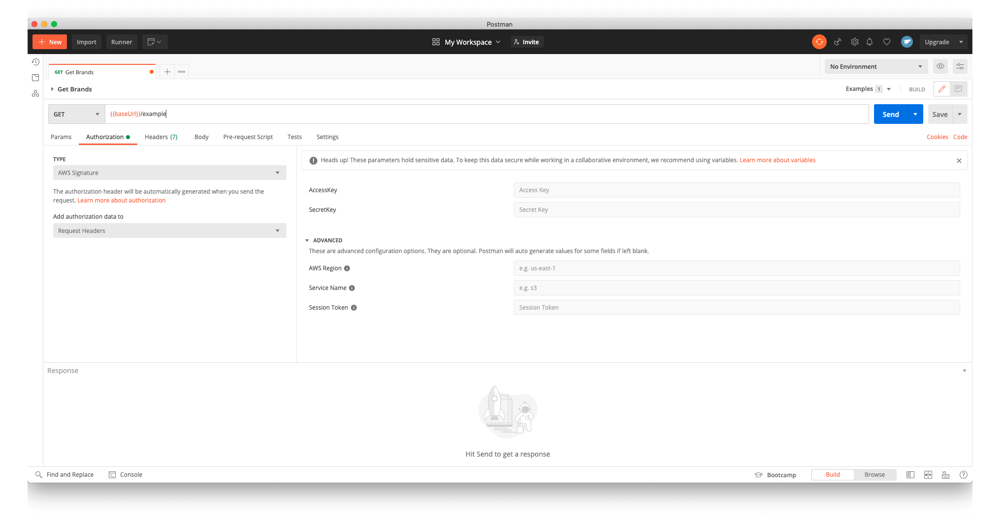

# cognito-login-helper

NodeJS project to help connecting and retreiving cognito temporary identity credentials :

- Access key
- Secret access key
- Session token

## Node.js (Install)

Requirements:

- Node.js
- npm (Node.js package manager)

```bash
npm install
```

## Usage

- Open index.js
- Fill the required constants
- Execute the script

```bash
node index.js
```

## Postman

Once you have the required variables, you can open up a Postman window and fill the requirements.


